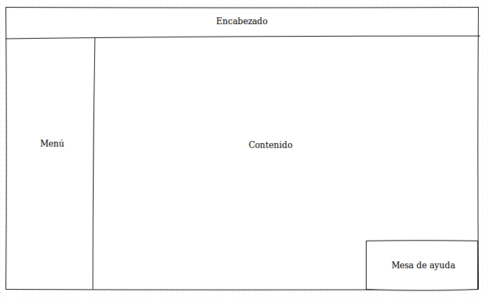

# Programación Web 1 - Trabajo Práctico integrador

El presente trabajo práctico tiene calidad de integrador, por lo que constará de dos partes. Durante la primera se implementará el maquetado y estilos de la página designada. La segunda parte consistirá en agregar comportamiento y algunos efectos con plugins de jQuery.

## Consigna

Se pide realizar el sitio web gubernamental de algún país a elección, enfocándose en un aspecto de su cultura. Por ejemplo, si el aspecto fuera "las artes marciales", un buen país a elegir sería Japón.  
Por supuesto el sitio deberá estar hecho en español, independientemente del país de elección. El tema no podrá repetirse entre diferentes grupos, por lo que deberán coordinar para no solaparse.

## Consideraciones generales

* Se deberá diseñar una página principal, respetando la disposición mostrada en esta sección:
    * El encabezado deberá tener un control para buscar dentro de la página (no funcional).
    * El menú tendrá el acceso a las siguientes páginas.
    * La mesa de ayuda deberá estar visible y fija en la posición todo el tiempo.
* Adicionalmente el sitio deberá tener al menos 4 páginas más.
* Una de ellas será un formulario de contacto con al menos 4 controles html diferentes.
* Se deberá utilizar un estilo propio, y no podrán usarse frameworks css de grillas como por ejemplo, [bootstrap](http://www.getbootstrap.com).
* Deberán incluír imágenes conforme la temática elegida.

## Condiciones de aprobación

* El trabajo será grupal, con grupos conformados por dos personas.
* Se deberá entregar el proyecto en formato `.zip`, en un pen-drive el día acordado.
* Se incluirán capturas significativas en cada uno de los tres browsers más utilizados (Firefox, Chrome e Internet Explorer)
* Los archivos deben estar nomenclados en minúsculas y mediante [snake case](http://en.wikipedia.org/wiki/Snake_case).
* El proyecto deberá estar ordenado en las carpetas correspondientes. No se admitirá un proyecto desordenado.
* El código deberá tener comentarios significativos, así como estar bien indentado.
* No se podrán utilizar frames ni iframes.
* No se aceptará el uso del tag `br` bajo ninguna circunstancia.
* Tampoco se aceptará el uso del atributo `style` para ningún elemento.
* Sólamente se admitirá el uso de tablas en el caso de que el elemento a representar sea semánticamente una tabla. Ejemplo: las posiciones en un torneo, o un listado encolumnado de medallistas olímpicos.
* Se evaluará que valide las normas de [html estricto](http://validator.w3.org/#validate_by_input) y [css](http://jigsaw.w3.org/css-validator/#validate_by_input). Pueden utilizar estos enlaces para validarlo ustedes mismos.

## Fechas de entrega

* **Primera parte:** 25/02/2014